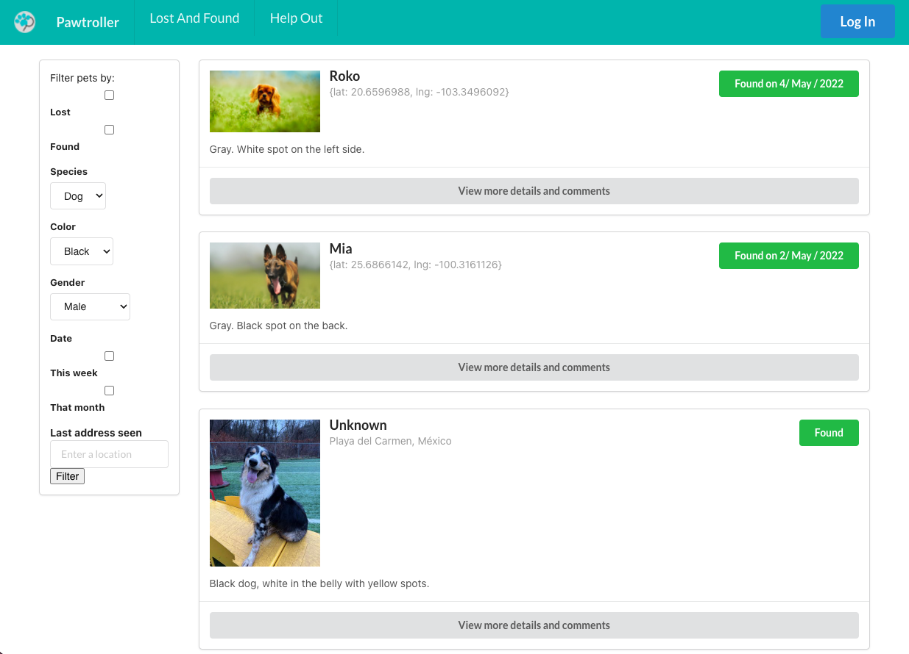

# Pet-Finder-Assistant 

### Description 

This is a React app that helps users post information of lost and found pets and contact each other without posting their personal data. It will allow the interaction between who is searching and who finds it. For people who found a lost pet and need support to give it shelter, the web app will accept donations. Users who want to post a lost or found pet must register before posting the information and photos of the pet. Any registered user will be able to comment on the publications of lost or found pets.
 

### How to use

The user can enter to the website and see a feed of pets. There the user can see pets that have been lost and have been found. Then the user can Sign Up to the page and Log In, and once they're logged in they can acces the Add a Pet form, where they can add a new Pet Placard.

### Website Appearance 

### [Published Site](https://paw-troller.herokuapp.com/ 
)

### Technologies

React
GraphQL
Node.js 
Express.js
MongoDB

**External Tools:**
Semantic UI
Apollo Client
EmailJS
Stripe
Google-map-react

### Credits
Team members:
- [Miguel Santamaría](https://github.com/StitchCodes)
- [Ernesto Rámirez](https://github.com/ernest1589)
- [Mario Patiño](https://github.com/mariopatino)
- [Dinorah Abrego](https://github.com/dinoabrego)

### Roadmap

This website allows for many different features to be implemented in the future. One feature we wish to include in future releases is utilizing the payment platform we are already using for donations and set up an online store where you can directly buy food, toys, pay for veterinary fees of found/stray dogs. That way the user can see directly what their money will be utilized in. We also want to set up a direct message in-app, so that the user doesn't have to contact other users directly through email and can stay in the page for direct communication.

### External Resources Consulted
[Stripe Checkout with React Crash Course](https://www.youtube.com/watch?v=BSN2KcB_h-M&t=778s)
[Stripe Checkout Client Only](https://codesandbox.io/s/stripe-checkout-client-only-zbqh5)
[How To Convert File To Base64 Format React Hook Component ](https://www.youtube.com/watch?v=qmr9NCYjueM)
[Image to Base64](https://github.com/Rinlama/react-howtoseries/blob/imagetobase64Tut/src/App.js)
